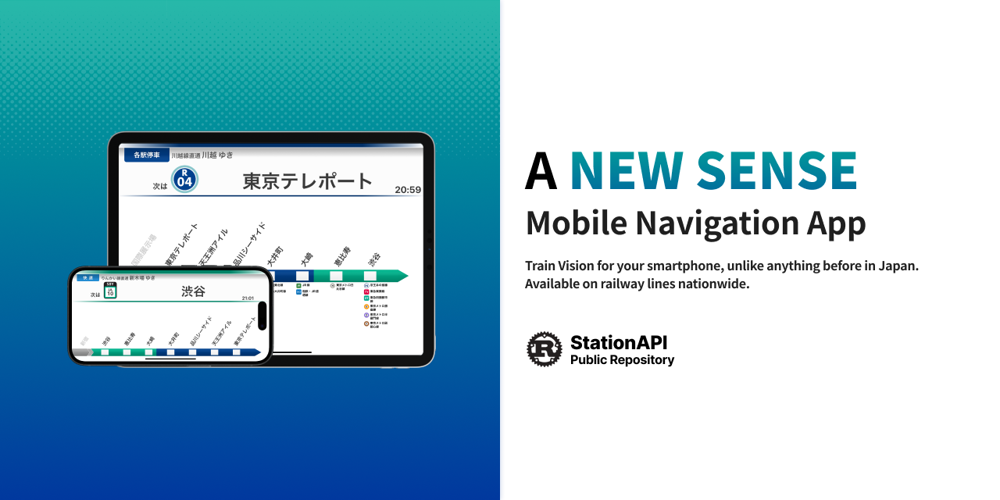

# StationAPI



<!-- ALL-CONTRIBUTORS-BADGE:START - Do not remove or modify this section -->

[](#contributors-)

<!-- ALL-CONTRIBUTORS-BADGE:END -->

The gRPC-Web API for provides nearby japanese train station.

## Documentation

- For automation agent and contributor workflows, see [AGENTS.md](AGENTS.md).
- For system architecture and design decisions, see [docs/architecture.md](docs/architecture.md).
- For technical debt analysis and architectural concerns, see [docs/technical_debt.md](docs/technical_debt.md).

## Data Contribution

This project includes a comprehensive dataset of Japanese railway information in the `data/` directory. The data is maintained in CSV format and contributions are primarily targeted at Japanese speakers. For detailed information about data structure and contribution guidelines, please refer to [data/README.md](data/README.md).

## Contributors ✨

Thanks goes to these wonderful people ([emoji key](https://allcontributors.org/docs/en/emoji-key)):

<!-- ALL-CONTRIBUTORS-LIST:START - Do not remove or modify this section -->
<!-- prettier-ignore-start -->
<!-- markdownlint-disable -->
<table>
  <tbody>
    <tr>
      <td align="center" valign="top" width="14.28%"><a href="https://sw-saturn.dev"><br /><sub><b>Kanta Demizu</b></sub></a><br /><a href="#data-Sw-Saturn" title="Data">🔣</a> <a href="#infra-Sw-Saturn" title="Infrastructure (Hosting, Build-Tools, etc)">🚇</a> <a href="https://github.com/TrainLCD/StationAPI/commits?author=Sw-Saturn" title="Code">💻</a></td>
      <td align="center" valign="top" width="14.28%"><a href="https://nrsy.jp"><br /><sub><b>SAIGUSA Tomotada</b></sub></a><br /><a href="#ideas-10mocy" title="Ideas, Planning, & Feedback">🤔</a> <a href="#data-10mocy" title="Data">🔣</a></td>
      <td align="center" valign="top" width="14.28%"><a href="https://github.com/mittan12"><br /><sub><b>mittan12</b></sub></a><br /><a href="#data-mittan12" title="Data">🔣</a></td>
      <td align="center" valign="top" width="14.28%"><a href="http://coderabbit.ai"><br /><sub><b>CodeRabbit</b></sub></a><br /><a href="https://github.com/TrainLCD/StationAPI/pulls?q=is%3Apr+reviewed-by%3Acoderabbitai" title="Reviewed Pull Requests">👀</a></td>
    </tr>
  </tbody>
</table>

<!-- markdownlint-restore -->
<!-- prettier-ignore-end -->

<!-- ALL-CONTRIBUTORS-LIST:END -->

This project follows the [all-contributors](https://github.com/all-contributors/all-contributors) specification. Contributions of any kind welcome!

## Join our community(Japanese only)

Do you like this project? Join our Discord community!
[https://discord.gg/qKT7zSGQre](https://discord.gg/qKT7zSGQre)

## Development

### Running Tests

This project includes comprehensive tests for the repository layer:

#### Unit Tests (No database required)

```bash
# Using Cargo directly
cargo test --lib --package stationapi

# Or using Make
make test-unit
```

#### Integration Tests (Requires PostgreSQL)

```bash
# Set up environment and run integration tests
source .env.test
cargo test --lib --package stationapi --features integration-tests

# Or using Make
make test-integration
```

#### All Tests

```bash
# Run unit tests followed by integration tests
make test-all
```

For detailed testing information, see [docs/repository_testing.md](docs/repository_testing.md).

### Test Coverage

Repository layer tests cover:

- ✅ Data conversion logic (`Row` → `Entity`)
- ✅ Database query operations
- ✅ Error handling and edge cases
- ✅ Filtering conditions (`e_status`, `pass` fields)
- ✅ Alias handling (line names)
- ✅ Type conversions (`u32` ↔ `i32`, `u32` ↔ `i64`)

### Testing Philosophy

We follow Rust best practices for testing:

- **Unit tests** run without external dependencies (fast, always available)
- **Integration tests** controlled by feature flags (opt-in when database is available)
- **Cargo-native** test execution using standard `cargo test` commands
- **Makefile shortcuts** for common testing workflows

## Data Sources

- Bus-related data provided by [Tokyo Metropolitan Bureau of Transportation (Toei)](https://www.kotsu.metro.tokyo.jp/), licensed under [CC BY 4.0](https://creativecommons.org/licenses/by/4.0/)
- Station data provided by [駅データ.jp](https://www.ekidata.jp/)
